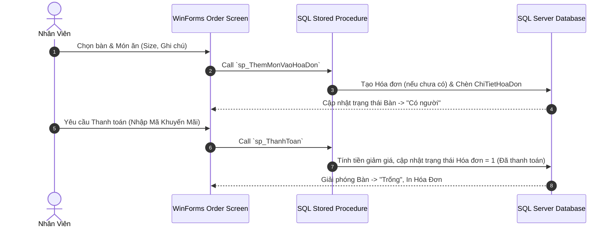
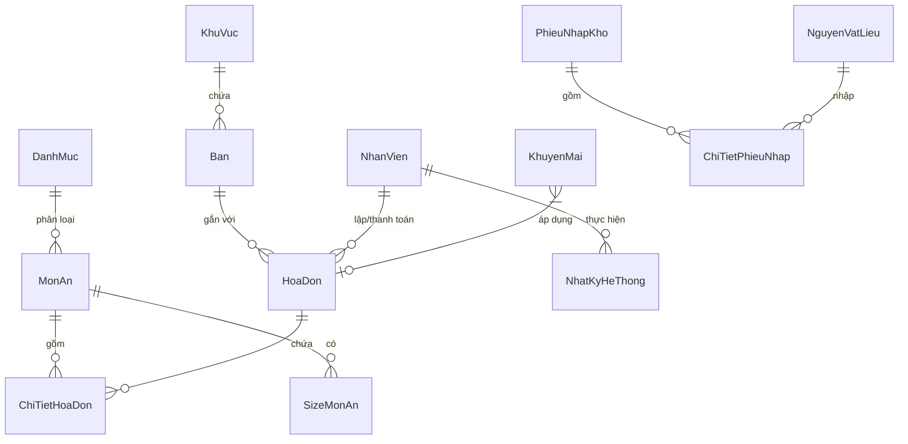

# ☕ QLCF - Hệ Thống Quản Lý Quán Cà Phê (Coffee Shop Management System)

<div align="center">


**Đồ án Môn học**  
*Phần mềm quản lý bán hàng, sơ đồ bàn, kho nguyên liệu và hóa đơn toàn diện cho quán cà phê.*

👨‍💻 **Tác giả (Author):** **Đỗ Thanh Hải**

</div>

---

## 📌 1. Giới Thiệu (Overview)

**QLCF (Quản Lý Cà Phê)** là một ứng dụng Desktop hoàn chỉnh được xây dựng nhằm giải quyết triệt để các bài toán vận hành thực tế tại các quán cà phê, trà sữa vừa và nhỏ. 

Hệ thống cung cấp giao diện trực quan, dễ thao tác cho nhân viên bán hàng cũng như bộ công cụ quản trị mạnh mẽ cho người quản lý: từ **sơ đồ bàn thời gian thực**, **gọi món tùy chọn size/ghi chú**, **áp dụng mã giảm giá linh hoạt**, cho tới **quản lý tồn kho nguyên liệu tự động** và **mã hóa bảo mật mật khẩu tài khoản**.

Dự án này được thiết kế và triển khai như một **Đồ án môn học chuẩn hóa**, đáp ứng đầy đủ các tiêu chuẩn kỹ thuật về kiến trúc phần mềm, tối ưu CSDL SQL Server và bảo mật thông tin để đưa vào **CV / Portfolio ấn tuyển GitHub**.

---

## ✨ 2. Tính Năng Nổi Bật (Key Features)

### 🪑 Quản Lý Sơ Đồ Bàn & Khu Vực (Table & Zone Management)
- Hiển thị danh sách bàn theo từng khu vực (Tầng 1, Tầng 2, Sân vườn...).
- Trạng thái bàn cập nhật thời gian thực (*Trống*, *Có người*, *Đặt trước*).
- Hỗ trợ đổi bàn, gộp bàn và chuyển đơn hàng giữa các bàn linh hoạt.

### 🍵 Quản Lý Thực Đơn & Gọi Món (Menu & Ordering POS)
- Phân loại món ăn theo danh mục (Cà phê, Trà sữa, Sinh tố, Đồ ăn vặt...).
- Chọn Size món (S, M, L) với giá phụ thu linh hoạt.
- Thêm ghi chú chi tiết cho từng món (ví dụ: *50% đường, ít đá, nhiều sữa...*) giúp bộ phận pha chế dễ dàng theo dõi.

### 💳 Thanh Toán & Mã Khuyến Mãi (Billing & Promotion)
- **Tự động tính toán tổng tiền**: Tiền gốc, phụ thu size, giảm giá khuyến mãi.
- **Hệ thống Mã giảm giá (Voucher)**: Hỗ trợ giảm theo **%** hoặc **số tiền cố định**, có điều kiện đơn hàng tối thiểu và giới hạn giảm tối đa.
- **Đa dạng phương thức thanh toán**: Tiền mặt, Chuyển khoản ngân hàng (QR Code), Ví điện tử.
- In hóa đơn thanh toán chi tiết cho khách hàng.

### 📦 Quản Lý Kho & Nguyên Vật Liệu (Inventory Management)
- Theo dõi tồn kho nguyên vật liệu (Cà phê hạt, Sữa đặc, Đường, Ly nhựa...).
- **Tự động cập nhật tồn kho khi nhập kho** thông qua **Database Trigger** SQL Server (`TRG_CapNhatTonKho_Nhap`).
- Cảnh báo các nguyên liệu sắp hết dựa trên mức định lượng an toàn.

### 🔒 Bảo Mật & Phân Quyền (Security & RBAC)
- **Mã hóa mật khẩu**: Sử dụng thuật toán Hash chuẩn công nghiệp **BCrypt** (`$2a$10$...`), chống lộ mật khẩu ngay cả khi cơ sở dữ liệu bị rò rỉ.
- **Phân quyền người dùng**: 
  - `Admin`: Toàn quyền quản trị thực đơn, nhân viên, báo cáo doanh thu, kho bãi, khuyến mãi.
  - `Nhân viên`: Thao tác order, chuyển bàn, thanh toán hóa đơn.
- **Nhật ký hệ thống (Audit Log)**: Ghi lại chi tiết mọi hành động quan trọng (nhân viên nào mở bàn, thanh toán, hủy đơn...) nhằm minh bạch hóa dữ liệu.

---

## 🛠️ 3. Công Nghệ Sử Dụng (Tech Stack)

| Thành phần | Công nghệ / Thư viện | Mô tả |
| :--- | :--- | :--- |
| **Language & Framework** | C# / .NET Framework | Ngôn ngữ hướng đối tượng & nền tảng ứng dụng Desktop |
| **UI Interface** | Windows Forms (WinForms) | Giao diện người dùng tùy biến trực quan, tối ưu trải nghiệm |
| **Database** | Microsoft SQL Server | Hệ quản trị CSDL quan hệ (Stored Procedures, Triggers, Views) |
| **Security** | BCrypt.Net | Mã hóa Hash mật khẩu an toàn cao |
| **Architecture** | 3-Tier Architecture / DAO Pattern | Phân tách rõ ràng giữa UI, Bus Logic và Data Access Layer |

---

## 📐 4. Kiến Trúc & Luồng Dữ Liệu (Architecture & Flow)

### Mô Hình Xử Lý Đơn Hàng & Thanh Toán


### Sơ Đồ Quan Hệ Cơ Sở Dữ Liệu (Database Schema Snapshot)


---

## 🗄️ 5. Chi Tiết Cơ Sở Dữ Liệu (SQL Highlights)

Cơ sở dữ liệu được thiết kế chuẩn hóa (3NF) với file tổng hợp duy nhất [`QLCF_Database_Complete.sql`](./QLCF_Database_Complete.sql):

- **Triggers**:
  - `TRG_CapNhatTonKho_Nhap`: Tự động cộng/trừ số lượng tồn kho nguyên vật liệu ngay khi có phiếu nhập kho mới hoặc điều chỉnh phiếu nhập.
- **Stored Procedures**:
  - `sp_ThemMonVaoHoaDon`: Thêm món, tính toán đơn giá theo size, xử lý tự động tạo hóa đơn và đổi trạng thái bàn.
  - `sp_ThanhToan`: Tính toán chiết khấu voucher/khuyến mãi, cập nhật thời gian ra, tính tổng tiền thực trả và giải phóng bàn.
- **Views**:
  - `vw_LichSuHoaDon`: Tổng hợp thông tin lịch sử giao dịch (Người mở, Người thanh toán, Bàn, Khu vực, Số tiền giảm...).

---

## 🚀 6. Hướng Dẫn Cài Đặt & Chạy Dự Án (Installation)

### Yêu Cầu Tiền Đề (Prerequisites)
- **Visual Studio 2019 / 2022** (đã cài đặt `.NET desktop development`).
- **Microsoft SQL Server 2016** hoặc cao hơn (hoặc SQL Server Express / LocalDB).
- **SQL Server Management Studio (SSMS)**.

### Các Bước Cài Đặt

1. **Clone Repository về máy local:**
   ```bash
   git clone https://github.com/dothanhhai/QLCF.git
   cd QLCF
   ```

2. **Khởi tạo Cơ sở Dữ liệu SQL Server:**
   - Mở ứng dụng **SSMS** và kết nối tới SQL Server của bạn.
   - Mở file [`QLCF_Database_Complete.sql`](./QLCF_Database_Complete.sql).
   - Nhấn `F5` hoặc chọn **Execute** để tạo cơ sở dữ liệu `QLCF`, toàn bộ Bảng, Views, Triggers, Stored Procedures và Dữ liệu mẫu.

3. **Cấu hình Chuỗi Kết Nối (Connection String):**
   - Mở file `App.config` trong dự án.
   - Thay đổi thuộc tính `connectionString` phù hợp với thông tin SQL Server trên máy của bạn:
   ```xml
   <connectionStrings>
     <add name="QLCFConnectionString" 
          connectionString="Data Source=YOUR_SERVER_NAME;Initial Catalog=QLCF;Integrated Security=True;" 
          providerName="System.Data.SqlClient" />
   </connectionStrings>
   ```

4. **Biên Dịch và Chạy Ứng Dụng:**
   - Mở file solution (`.sln`) trong Visual Studio.
   - Nhấn `Ctrl + Shift + B` để Rebuild Solution.
   - Nhấn `F5` để khởi chạy phần mềm.

---

## 🔑 7. Tài Khoản Đăng Nhập Mặc Định (Demo Credentials)

Cơ sở dữ liệu đã tích hợp sẵn 2 tài khoản mẫu dùng cho mục đích kiểm thử và chấm đồ án (Mật khẩu đã mã hóa BCrypt):

| Vai trò | Tên đăng nhập | Mật khẩu mặc định | Quyền hạn |
| :--- | :--- | :--- | :--- |
| 👑 **Quản Trị Viên (Admin)** | `admin` | `123456` | Toàn quyền quản trị hệ thống |
| 👤 **Nhân Viên Bán Hàng** | `nhanvien1` | `123456` | Gọi món, chuyển bàn, thanh toán |

> [!TIP]
> Bạn có thể tạo thêm nhân viên mới hoặc đổi mật khẩu trực tiếp trong giao diện quản trị Admin sau khi đăng nhập.

---

## 📁 8. Cấu Trúc Thư Mục Dự Án (Project Structure)

```text
QLCF/
│
├── 📄 QLCF_Database_Complete.sql    # Script SQL đầy đủ (Table, View, Trigger, SP, Sample Data)
├── 📄 README.md                     # Tài liệu hướng dẫn dự án (File này)
│
├── 📁 Presentation/                 # Tầng Giao diện người dùng (Forms, Controls, UI Components)
│   ├── FormLogin.cs                 # Màn hình đăng nhập
│   ├── FormMain.cs                  # Màn hình chính & Sơ đồ bàn POS
│   ├── FormAdmin.cs                 # Màn hình quản trị hệ thống
│   └── ...
│
├── 📁 BLL/                          # Tầng Xử lý Nghiệp vụ (Business Logic Layer)
│   ├── NhanVienBLL.cs               # Nghiệp vụ quản lý tài khoản & BCrypt
│   ├── HoaDonBLL.cs                 # Nghiệp vụ gọi món & thanh toán
│   └── ...
│
├── 📁 DAL/                          # Tầng Thao tác CSDL (Data Access Layer)
│   ├── DatabaseHelper.cs            # Kết nối & thực thi ADO.NET
│   ├── HoaDonDAL.cs                 # Truy vấn liên quan đến Hóa đơn
│   └── ...
│
└── 📁 DTO/                          # Đối tượng Dữ liệu (Data Transfer Objects / Models)
    ├── NhanVien.cs
    ├── MonAn.cs
    └── ...
```

---

## 👤 9. Tác Giả & Liên Hệ (Author & Contact)

- **Họ và tên:** **Đỗ Thanh Hải**
- **Dự án:** Đồ án Môn học - Lập trình C# & Hệ Quản Trị CSDL
- **GitHub:** [https://github.com/Thanhhai1404](https://github.com/Thanhhai1404)
- **Email:** haidxthanh2004@gmail.com

---

<div align="center">

⭐ **Nếu thấy dự án hữu ích, hãy tặng dự án 1 Star trên GitHub nhé!** ⭐

</div>
